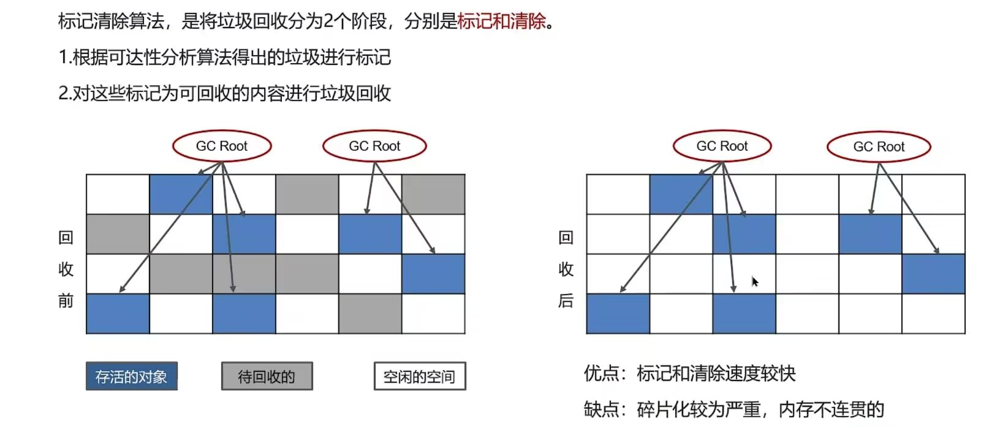
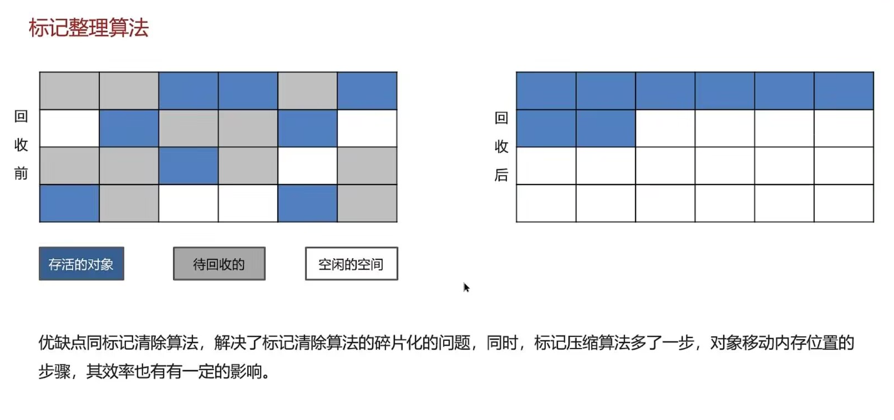
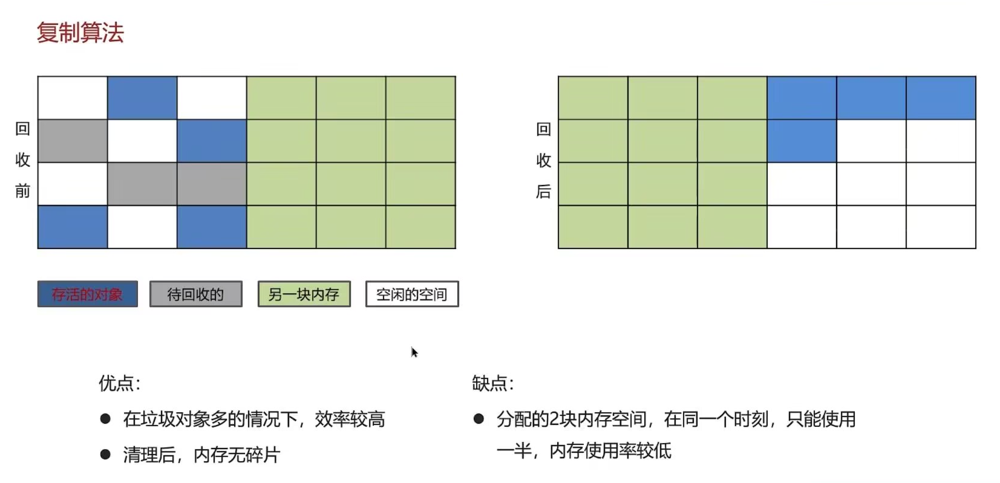

## 对象什么时候可以被垃圾回收？

如果一个或多个对象没有任何引用指向它了，那么这个对象现在就是垃圾，如果定位了垃圾，则有可能会被垃圾回收器回收。

**定位垃圾回收的方法**

> - 引用计数法
> - 可达性分析算法

## JVM垃圾回收算法都有哪些？

**标记清除算法**

**标记整理算法**

**复制算法**

## 说一下JVM中的分代回收

**堆的区域划分**

> - 堆被分为了两份：新生代和老年代（1：2）
> - 新生代分为三个区域，Eden区和两个Survivor区（分成from和to）,比例8:1:1

**对象回收--分代回收策略**

> 1. 新创建的对象，会先分配到Eden区
> 2. 当Eden区不足，标记Eden和from存活的对象
> 3. 将存活对象采用复制算法复制到to，复制完毕后，Eden和from内存都将释放
> 4. 经过一段时间Eden内存出现不足，标记Eden和to存活对象，将其复制到from，然后Eden和to释放
> 5. 当幸存者对象回收多次（最多15次），晋升到老年代（幸存者内存不足或大对象会提前晋升）

## MinorGC、Mixed GC、FullGC区别

> - miiorGC（young GC）发生在新生代的垃圾回收，暂停时间短
> - Mixed GC新生代+老年代部分区域的垃圾回收，G1收集器持有
> - Full GC：新生代+老年代完整垃圾回收，暂停时间长，应尽力避免

## JVM有哪些垃圾回收器？

> 串行垃圾回收器:Serial GC，Serial Old GC
>
> 并行垃圾回收器：Parallel Old GC，ParNew GC
>
> CMS（并发）垃圾回收器：CMS GC，最用在老年代
>
> G1垃圾回收器，最用在新生代和老年代

****
